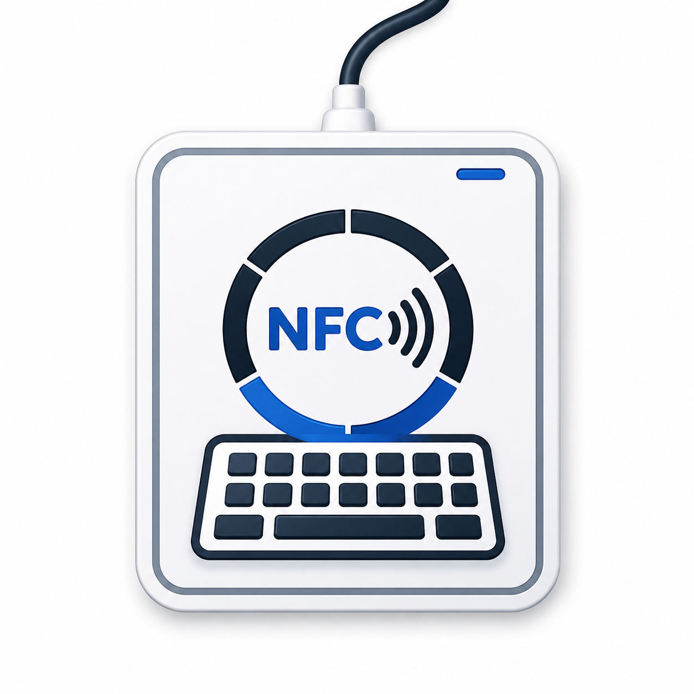
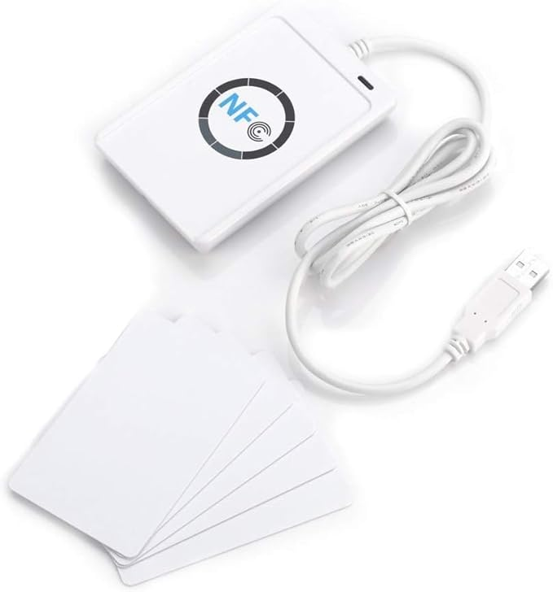

<div align="center">



# NFC ACR122U Reader Keyboard Emulator

**A lightweight NFC/RFID virtual keyboard emulator that automatically types scanned card UIDs into the active window.**

[](LICENSE)
[](https://www.python.org/)

[](https://www.amazon.fr/dp/B086HTYWR4)
[](#)

</div>

---

## About

Minimal Python project for interacting with an **ACS ACR122U NFC/RFID USB** reader.  

This project turns the reader into a keyboard-like input device.  
When a RFID/NFC card is scanned, the program reads the card UID, types it automatically as keyboard input, and presses Enter.

Features :

- Detect NFC cards/tags
- Read card UID
- Display raw reader responses
- Keyboard emulation mode
- Automatically type scanned UID followed by Enter
- Simple testing environment for NFC experiments

## Hardware

<table>
  <tr>
    <td width="320" align="center">
      <a href="https://www.amazon.fr/dp/B086HTYWR4">
        
      </a>
    </td>
    <td>

The project is built around the **ACS ACR122U**, a USB NFC/RFID reader widely used for smart card and contactless tag applications.  
It supports **ISO 14443 A/B**, **MIFARE**, and multiple NFC tag types through a standard **PC/SC** interface, making it easy to integrate with Python and desktop automation workflows.

Specifications :

- Reader: ACS ACR122U
- Interface: USB
- Protocols: NFC / RFID
- Communication: PC/SC
- Frequency: 13.56 MHz 
- Operating Distance: Up to 5 cm  

Reference : <a href="https://www.amazon.fr/dp/B086HTYWR4">Amazon Link</a>

  </td>
  </tr>
</table>

## Requirements

* Python 3.10+
* PC/SC compatible system
* ACS ACR122U NFC Reader

Python dependencies:

```txt
pyscard
pyautogui
```

## Installation

Clone the repository and install the required Python dependencies.

### 1. Clone the repository

```bash
git clone https://github.com/thomas-hinton/nfc-acr122u-reader.git
cd nfc-acr122u-reader
```

### 2. Create a virtual environment

```bash
python -m venv .venv
```

### 3. Activate the virtual environment

#### Windows (PowerShell)

```powershell
.venv\Scripts\Activate.ps1
```

#### Linux / macOS

```bash
source .venv/bin/activate
```

### 4. Install dependencies

```bash
pip install -r requirements.txt
```

## Usage

Run the main script to start the NFC reader and keyboard emulation :

```bash
python read_uid.py
```

> [!WARNING]  
> The scanned UID is typed into the currently focused window.  
> Make sure the correct input field is selected before scanning a card.  

Then place an NFC card on the reader.

## Keyboard Emulation

When a card is scanned:

1. The UID is read
2. The UID is automatically typed as keyboard input
3. The Enter key is pressed automatically

Example:

```txt
BB0FADA7
```

This allows the NFC reader to behave like a barcode scanner or keyboard wedge device.

## Example Console Output

```txt
Reader detected : ACS ACR122 0

Card UID : BB0FADA7
```

## Project Goal

This repository is intended as a playground for experimenting with:

* NFC communication
* APDU commands
* Keyboard emulation
* Card interactions using the ACS ACR122U reader

## License

This project is licensed under the MIT License.
See the [LICENSE](LICENSE) file for details.
